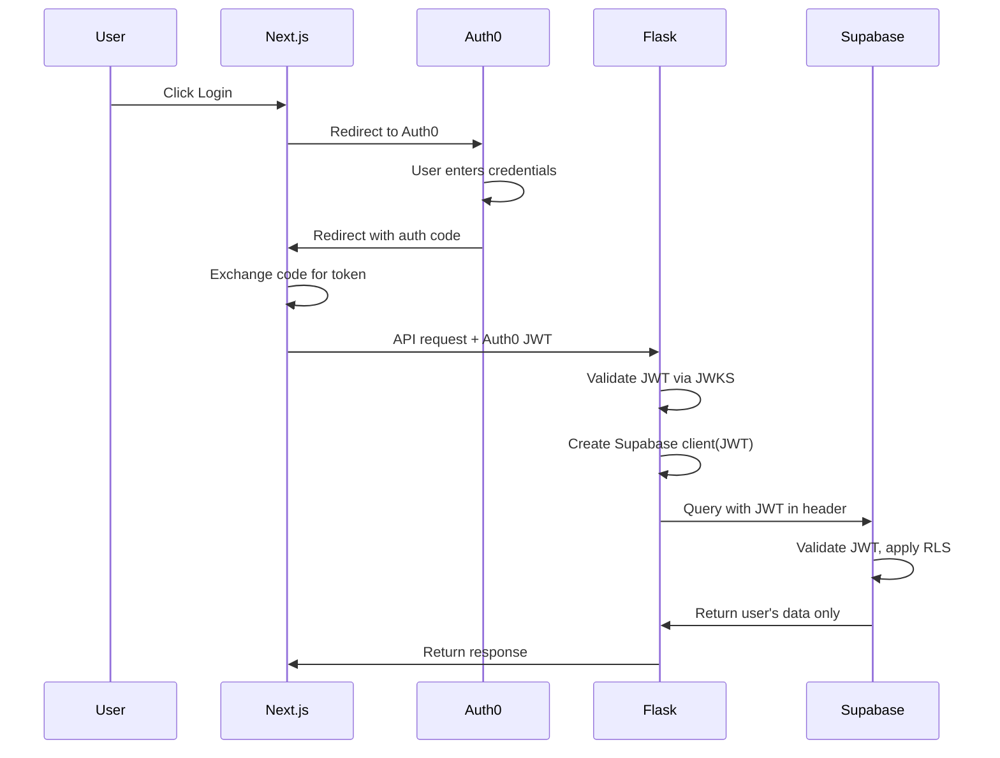

# Auth0 + Supabase RLS Migration - Quick Reference

## What Was Changed

### Frontend (Next.js)

✅ **Dependencies Added**
- `@auth0/nextjs-auth0` - Auth0 SDK
- ❌ `@supabase/supabase-js` - **NOT used from frontend** - removed

✅ **New Files**
- `app/api/auth/[auth0]/route.ts` - Auth0 callback handler
- `middleware.ts` - Route protection middleware

✅ **Updated Files**
- `lib/supabase.ts` - **DEPRECATED** - Frontend does NOT connect to Supabase directly
- `lib/auth0.ts` - Auth0 client initialization

### Backend (Flask)

✅ **Dependencies Added**
- `python-jose[cryptography]` - JWT validation
- `supabase` - Server-side Supabase RLS client

✅ **New Files**
- `app/auth.py` - JWT validation and `@requires_auth` decorator
- `app/supabase_rls.py` - Supabase client with RLS support (`create_user_client()`, `create_service_client()`)

✅ **Updated Files**
- `app/main.py` - Routes protected with `@requires_auth`, use `create_user_client()` for RLS queries
- `pyproject.toml` - Added dependencies

---

## How It Works

### User Login Flow



### Token Validation

1. **Frontend stores** Auth0 JWT in secure cookie
2. **Frontend sends** JWT in HTTP request to backend API
3. **Backend validates** JWT signature using Auth0 JWKS
4. **Backend creates** Supabase client with JWT token
5. **Supabase validates** JWT via third-party Auth0 issuer
6. **RLS policies** filter data by `auth.jwt() ->> 'sub'` (user ID)
7. **Backend returns** only authorized data to frontend

**Key**: Frontend NEVER talks to Supabase directly

---

## Key Code Examples

### Frontend: Get Auth0 Token & Make API Call

```typescript
// Next.js Server Component or Route Handler
import { getAccessToken } from '@auth0/nextjs-auth0';

export default async function MyPage() {
  const { token } = await getAccessToken();
  
  // Call backend API with token
  const response = await fetch('http://localhost:8000/api/votes', {
    headers: {
      'Authorization': `Bearer ${token}`,
    },
  });
  
  const votes = await response.json();
  return <div>{votes.length} votes</div>;
}
```

### Backend: Use Supabase with RLS

```python
# app/main.py
from app.auth import requires_auth, get_current_user, get_bearer_token
from app.supabase_rls import create_user_client

@app.route("/api/votes", methods=["GET"])
@requires_auth
def get_user_votes():
    token = get_bearer_token()
    supabase = create_user_client(token)
    
    # RLS ensures only this user's votes are returned
    response = supabase.table("votes").select("*").execute()
    return jsonify(response.data)

@app.route("/api/votes", methods=["POST"])
@requires_auth
def create_vote():
    user_id = get_current_user()["sub"]
    token = get_bearer_token()
    data = request.get_json()
    
    supabase = create_user_client(token)
    
    # RLS will reject if user_id doesn't match JWT "sub"
    response = supabase.table("votes").insert({
        "user_id": user_id,
        "bill_id": data["bill_id"],
        "vote": data["vote"],
    }).execute()
    
    return jsonify(response.data), 201
```

### Backend: Manual Token Validation (if needed)

```python
from app.auth import get_bearer_token, validate_token

token = get_bearer_token()
if token:
    try:
        user_info = validate_token(token)
        print(f"User ID: {user_info['sub']}")
    except InvalidTokenError as e:
        print(f"Invalid token: {e}")
```

---

## What You Need to Do

### 1. Install Dependencies

```bash
# Frontend
cd frontend
npm install  # or pnpm install

# Backend
cd backend
pip install -e .
```

### 2. Configure Environment Variables

**Frontend** (`frontend/.env.local`):
```env
AUTH0_DOMAIN=dev-XXXXXXXX.us.auth0.com
AUTH0_CLIENT_ID=...
AUTH0_CLIENT_SECRET=...
AUTH0_SECRET=...
APP_BASE_URL=http://localhost:3000
```

**Backend** (`backend/.env`):
```env
AUTH0_DOMAIN=dev-XXXXXXXX.us.auth0.com
SUPABASE_URL=https://...supabase.co
SUPABASE_ANON_KEY=sb_publishable_...
SUPABASE_SERVICE_ROLE_KEY=...  (🔒 KEEP SECRET)
LEGISCAN_API_KEY=...
```

### 3. Configure Auth0

Follow the detailed guide in [AUTH0_SUPABASE_MIGRATION.md](./AUTH0_SUPABASE_MIGRATION.md):
- Create an Auth0 Action to add custom claims
- Configure the Auth0 API with custom claims
- Set Auth0 Application URLs

### 4. Configure Supabase (Third-Party Auth)

Follow the detailed guide in [AUTH0_SUPABASE_MIGRATION.md](./AUTH0_SUPABASE_MIGRATION.md):
- Enable third-party JWT for Auth0
- Create RLS policies using `auth.jwt() ->> 'sub'`

### 5. Create Backend API Routes

For any table you want to expose:
```python
@app.route("/api/table-name", methods=["GET"])
@requires_auth
def get_table():
    token = get_bearer_token()
    supabase = create_user_client(token)
    response = supabase.table("table_name").select("*").execute()
    return jsonify(response.data)
```

### 6. Test the Flow

```bash
# 1. Login via frontend
# 2. Test backend API with the token:

TOKEN="your_auth0_token"
curl -H "Authorization: Bearer $TOKEN" http://localhost:8000/api/votes

# Should return 200 with your data, not 401
```

---

## Create New Backend API Routes

Always follow this pattern for data access endpoints:

```python
from app.auth import requires_auth, get_current_user, get_bearer_token
from app.supabase_rls import create_user_client

@app.route("/api/my-resource", methods=["GET"])
@requires_auth
def get_my_resource():
    user_id = get_current_user()["sub"]
    token = get_bearer_token()
    
    supabase = create_user_client(token)
    
    # RLS automatically filters by user_id
    response = supabase.table("my_table").select("*").execute()
    return jsonify(response.data)

@app.route("/api/my-resource", methods=["POST"])
@requires_auth
def create_resource():
    user_id = get_current_user()["sub"]
    token = get_bearer_token()
    data = request.get_json()
    
    supabase = create_user_client(token)
    
    # RLS validates that data belongs to authenticated user
    response = supabase.table("my_table").insert({
        "user_id": user_id,  # Always include the user_id
        **data
    }).execute()
    
    return jsonify(response.data), 201
```

**Key Points**:
- ✅ Always use `@requires_auth` decorator
- ✅ Always get the token with `get_bearer_token()`
- ✅ Always create Supabase client with `create_user_client(token)`
- ✅ Always include `user_id` when inserting (RLS validates it)
- ❌ Never connect to Supabase from the frontend
- ❌ Never expose the service_role_key to the frontend

---

## Enable Route Protection in Middleware (Optional)

To protect frontend routes, uncomment in `middleware.ts`:

```typescript
export const config = {
  matcher: [
    '/dashboard/:path*',      // Protect dashboard
    '/api/protected/:path*',  // Protect API routes
  ],
};
```

---

## File Structure After Migration

```
frontend/
├── app/
│   └── api/
│       └── auth/
│           └── [auth0]/
│               └── route.ts          ✅ NEW
├── lib/
│   ├── auth0.ts                      ✅ Already configured
│   └── supabase.ts                   ✅ Already configured
├── middleware.ts                     ✅ NEW
└── package.json                      ✅ Updated

backend/
├── app/
│   ├── auth.py                       ✅ NEW
│   ├── legiscan.py
│   └── main.py                       ✅ Updated
└── pyproject.toml                    ✅ Updated
```

---

## Common Issues & Fixes

| Issue | Cause | Fix |
|-------|-------|-----|
| 401 on backend | Missing Auth0 domain env | Set `AUTH0_DOMAIN` in `backend/.env` |
| 401 on backend | Token missing "role" claim | Deploy Auth0 Action |
| Frontend directly queries Supabase | Architecture | Use `create_user_client()` in backend API instead |
| RLS rejects all queries | User ID type mismatch | Use `(auth.jwt() ->> 'sub')::uuid` if column is UUID |
| RLS rejects queries | RLS policy syntax error | Verify policy with `SELECT * FROM pg_policies;` |
| service_role key exposed | Accidental commit | Rotate key in Supabase Settings → API |

---

## Next Steps for Your Team

1. ✅ Code changes complete - ready to install dependencies
2. 📋 Follow [AUTH0_SUPABASE_MIGRATION.md](./AUTH0_SUPABASE_MIGRATION.md) for Auth0 & Supabase setup
3. 🛠️ Add backend API routes for each table (following the pattern above)
4. 🧪 Test end-to-end: login → API call → Supabase RLS verification
5. 🚀 Deploy to staging to verify in production-like environment

**⚠️ Critical**: Frontend NEVER connects directly to Supabase. All queries must go through backend API routes.

---

## Support

For detailed configuration instructions, see: [AUTH0_SUPABASE_MIGRATION.md](./AUTH0_SUPABASE_MIGRATION.md)

